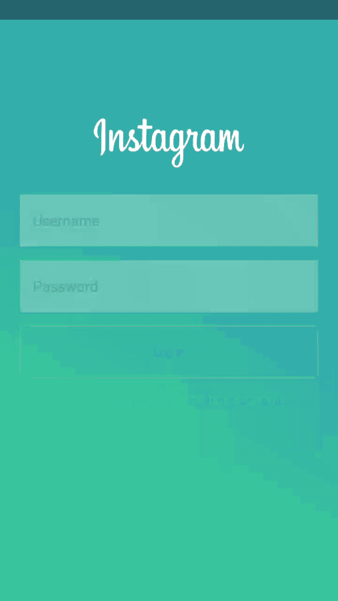
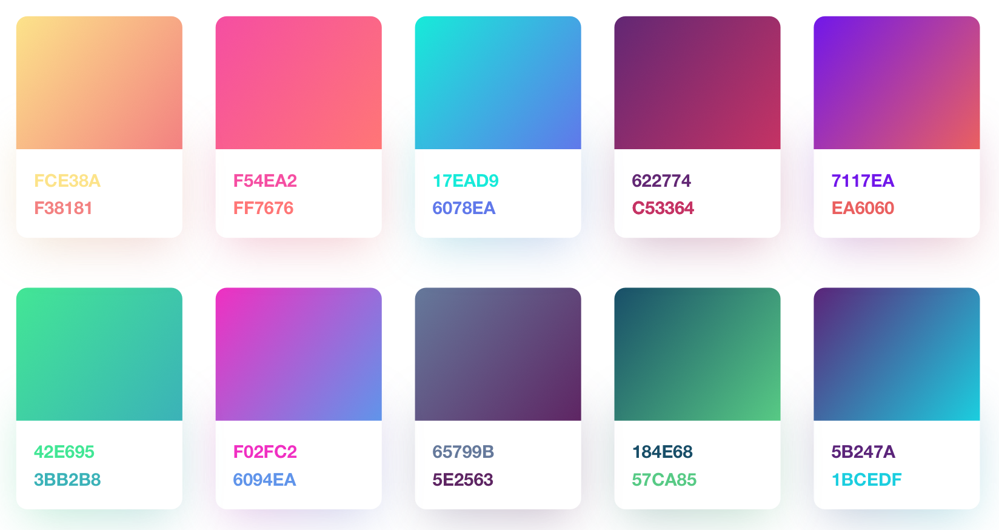

# Spark(Work-in-progress)
Create gradient animations like Instagram&Spotify.

# Screenshots
<div align="center">
	
</div>

## Usage
```kotlin
override fun onCreate(savedInstanceState: Bundle?) {
	super.onCreate(savedInstanceState)
	setContentView(R.layout.activity_main)
	
	val spark = Spark.Builder()
	        .setView(frameLayout) // View or view group
	        .setDuration(4000)
	        .setAnimList(Spark.ANIM_GREEN_PURPLE)
	        .build()

	spark.startAnimation()
}
```

## Installation
It will be published on jcenter in the future.

## Custom Gradient Colors
### Create gradient drawables
`purple_drawable.xml`

```xml
<?xml version="1.0" encoding="utf-8"?>
<shape xmlns:android="http://schemas.android.com/apk/res/android"
    android:shape="rectangle">

    <gradient
        android:centerColor="#e459aa"
        android:endColor="#cd7be6"
        android:startColor="#f14589"
        android:type="linear" />

    <corners android:radius="0dp" />

</shape>
```

`yellow_drawable.xml`

```xml
<?xml version="1.0" encoding="utf-8"?>
<shape xmlns:android="http://schemas.android.com/apk/res/android"
    android:shape="rectangle">

    <gradient
        android:centerColor="#F4A37B"
        android:endColor="#F08875"
        android:startColor="#F9CB87"
        android:type="linear"/>

    <corners android:radius="0dp" />

</shape>
```

### Create the animation list
`custom_anim_list.xml`

```xml
<?xml version="1.0" encoding="utf-8"?>
<animation-list xmlns:android="http://schemas.android.com/apk/res/android"
    android:oneshot="false">

    <item
        android:drawable="@drawable/yellow_drawable"
        android:duration="4500" />

    <item
        android:drawable="@drawable/purple_drawable"
        android:duration="4500" />

</animation-list>
```

### Apply your custom animation list
```kotlin
Spark.Builder()
    .setView(frameLayout) // View or view group
    .setDuration(4000)
    .setAnimList(Spark.ANIM_GREEN_PURPLE)
    .build()
    .startAnimation()
```

For the colors, I referred to [Alexander Zaytsev](https://dribbble.com/anwaltzzz)'s [shot](https://dribbble.com/shots/3380672-Sketch-Gradients-Freebie) on Dribbble.



## License
Charles is under the MIT license. See the [LICENSE](LICENSE) for more information.